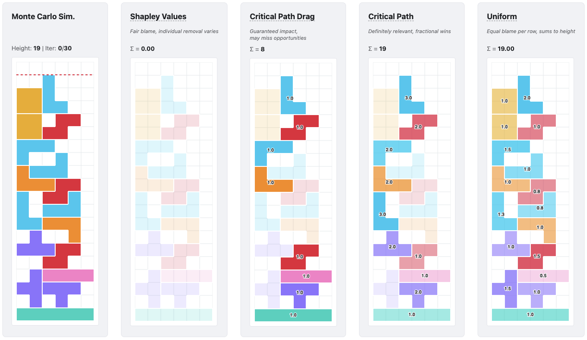

# shapcpm

**Efficient Calculation of Shapley Values in Critical Path Method (CPM) Networks for Concurrent Delay Analysis**

`shapcpm` allocates the total duration of a project to its constituent activities using Shapley values computed over a CPM network. Each activity receives an additive share of the makespan, so any rollup sums cleanly to the total.

The library ships two solvers:

- An **exact solver** (`get_shapley_values_exact`) built on a novel `CPMTree` decision-tree data structure introduced by this library. Instead of enumerating every permutation in $O(2^n)$ required by the direct method, the tree-based approach exploits the structure of the CPM network to achieve $O(m^2)$ complexity over number of unique critical paths.
- An **approximate solver** (`get_shapley_values_approx`) that implements the Monte Carlo simulation algorithm of [Wang, Wang & Jin (2024)](https://doi.org/10.1016/j.cie.2024.110603).

## Why shapcpm

Critical Path Analysis tells you which activities lie on the longest path, but it does not tell you how much shortening any one of them would actually save — a parallel branch may absorb the slack. Marginal (counterfactual) analysis answers that one group at a time, but you have to know in advance which groups to look at.

`shapcpm` gives you a per-activity score that is:

- **Additive across any rollup.** The Shapley values for all activities sum exactly to the project makespan. Compute the scores once, then let downstream consumers slice and sum by any attribute of the activities — without rerunning attribution. This is what turns attribution from a research artifact into a production tool.
- **Defensible.** Each activity's score is its [Shapley value](https://en.wikipedia.org/wiki/Shapley_value) — its average marginal effect on the makespan across all orderings of the other activities. Shapley values are the unique allocation satisfying *efficiency*, *symmetry*, *additivity*, and the *dummy player* property, the four conditions widely accepted as defining a fair split.
- **Tractable at scale.** The exact solver runs in $O(m^2)$ where `m` is the number of unique critical paths in the network — typically much smaller than the activity count $n$, which makes it very fast in practice. Pathological networks can drive $m$ upward and degrade the cost toward $O(n^2)$; for those cases `shapcpm` ships an approximate Monte Carlo solver that is linear in the number of iterations.

It is well suited to:

- **Any Critical Path Method (CPM) Networks** — construction schedules, ML pipelines, ETL graphs, manufacturing routings — who wants per-node attribution rather than just the critical path.
- **Project-management researchers** extending or comparing against [Wang, Wang & Jin (2024)](https://doi.org/10.1016/j.cie.2024.110603).

## Visualization

The clip below shows the Monte Carlo solver in action on a 5-activity CPM network. On each iteration it draws a random ordering of the activities, removes them one by one, and tracks how much the makespan drops — that drop is the activity's marginal contribution. Repeating across many random orderings averages out into the per-activity Shapley values shown on the right.

https://github.com/user-attachments/assets/a9232231-a7c7-4ee8-9ecc-824019e7c4cc

## Demo
The algorithm can be explained using the analogy of allocating blame for a lost Tetris game to individual blocks. Although a Tetris board differs from a CPM network, dependencies between blocks enable the application of the same Monte Carlo simulation to allocate blame using the Shapley Value approach. The following demo illustrates the simulation and compares its results against other standard allocation methods, including Critical Path, Critical Path Drag, and Uniform allocation.

https://facebookresearch.github.io/shapcpm/demo

[](https://facebookresearch.github.io/shapcpm/demo)

## Installation

```bash
pip install shapcpm
```

## Quickstart

Build a CPM network of tasks and dependencies, then ask for the exact Shapley values:

```python
from shapcpm import CPMNetworkBuilder

# Two parallel paths into a shared finish task:
"""
   A(10) ──┐
           ├──> C(30)     critical path:  B → C, total = 50
   B(20) ──┘
"""
network = (
    CPMNetworkBuilder()
    .add_task("A", 10)
    .add_task("B", 20)
    .add_task("C", 30)
    .add_dependency("C", "A")  # C depends on A
    .add_dependency("C", "B")  # C depends on B
    .build()
)

network.get_last_end_time()
# 50
network.get_critical_path()
# ["B", "C"]
network.get_shapley_values_exact()
# {"A": 4.999..., "B": 14.999..., "C": 30.0}
# Sum: 50 — the full makespan, distributed across all three tasks.
```

`A` carries some blame even though it is not on the critical path: in the orderings where `B` is removed first, `A` becomes the binding predecessor of `C`. That is exactly the kind of contribution a critical-path-only view misses.

For larger networks, switch to the Monte-Carlo solver:

```python
network.get_shapley_values_approx(num_samples=10_000)
```

## Examples and case studies

The decomposition theorems in `shapcpm` were originally developed for Meta's Continuous Integration Time analysis; see the companion [CCIW @ ICST 2026 talk](#documentation) for how they are wired into production.

For research-style examples, the three case studies in Wang, Wang & Jin (2024) — a 7-activity house build, a 13-activity construction project, and a 22-activity classic from Levy, Thompson & Wiest (1963) — make small, well-known reproductions. 

Worked notebooks live in [`docs/examples/`](docs/examples/):
- [`wang2024_case1.ipynb`](docs/examples/wang2024_case1.ipynb) — reproduces the 7-activity house-build network from Case 1 of Wang, Wang & Jin (2024), and discusses how `shapcpm`'s makespan attribution relates to the paper's delay attribution.- 

## Documentation

- **Talk.** Swierc, S. *A Hybrid Approach to Optimizing CI Time at Scale: Marginal and Concurrent Delay Analysis.* CI/CD Industry Workshop (CCIW) at ICST 2026 — how Shapley Values are at Meta. *Slides and video link will be added after the conference.*
- **Paper.** Wang, H., Wang, W., & Jin, Z. (2024). *Mechanism for allocating delay to constituent activities in project management.* Computers & Industrial Engineering, 197, 110603. [doi.org/10.1016/j.cie.2024.110603](https://doi.org/10.1016/j.cie.2024.110603) — the mathematical foundation.

## Getting help

- **Bugs and feature requests.** Open a [GitHub issue](https://github.com/facebookresearch/shapcpm/issues). Networks where the approximate solver underperforms are especially welcome — they help us extend the skip-condition set.
- **Questions and discussion.** [GitHub Discussions](https://github.com/facebookresearch/shapcpm/discussions). [CONFIRM Discussions enabled.]
- **Publications using `shapcpm`.** If you publish on top of the library, open an issue tagged `publication` and we will link to it from the README.

## Citation

If you use `shapcpm` in academic work, please consider citing it as:

```bibtex
@inproceedings{swierc2026shapcpm,
  title     = {A Hybrid Approach to Optimizing Build and Test Time: 
              Marginal and Concurrent Delay Analysis},
  author    = {Swierc, Stanislaw and Yost, Scott and Villa, Ben},
  maintitle = {IEEE Conference on Software Testing, Verification and Validation (ICST)},
  booktitle = {Proceedings of the 6th CI/CD Industry Workshop (CCIW)},
  year      = {2026},
}
```

## Contributing

We welcome pull requests. Please read [`CONTRIBUTING.md`](CONTRIBUTING.md) before submitting changes; this project adopts the [Contributor Covenant Code of Conduct](CODE_OF_CONDUCT.md).

`shapcpm` is maintained by Meta with a minimum 6-month commitment beyond launch to address issues and community questions.

## License

`shapcpm` is MIT licensed, as found in the [LICENSE](LICENSE) file.


